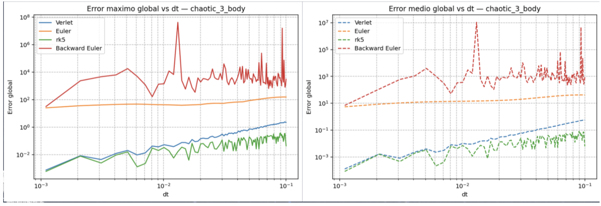
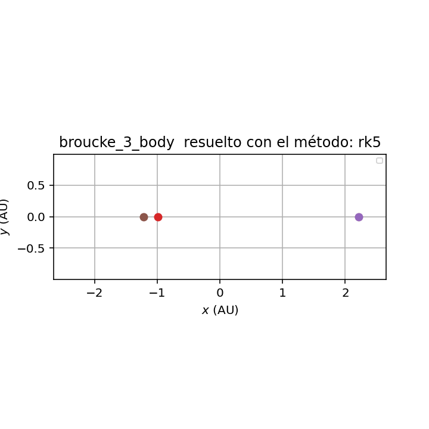
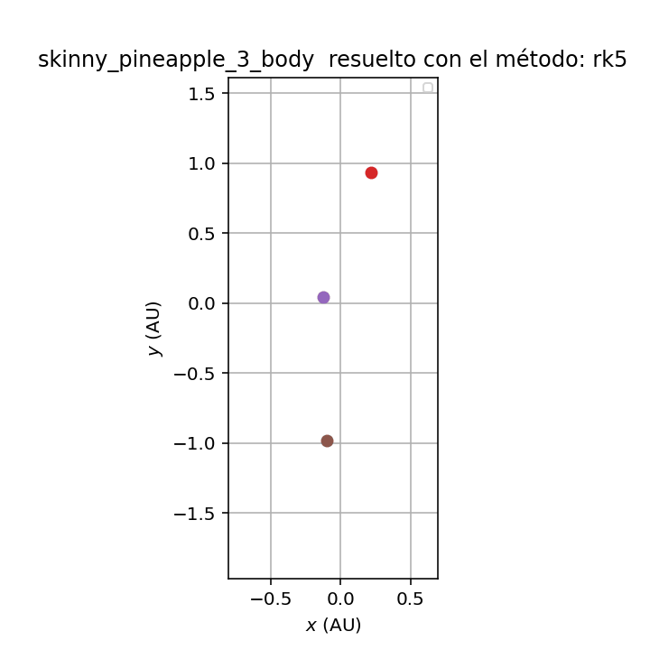
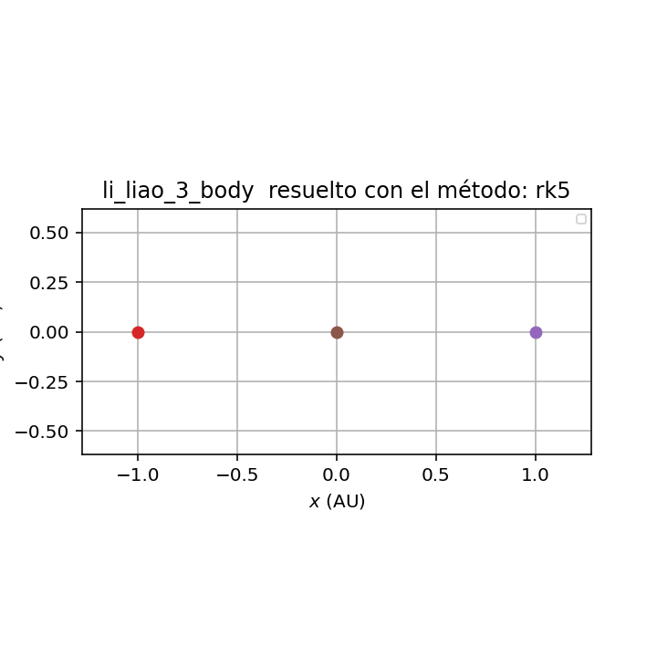
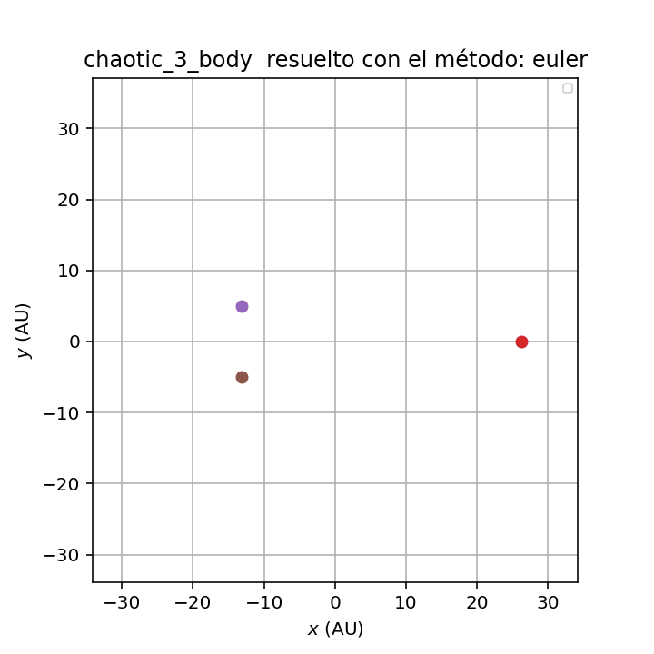
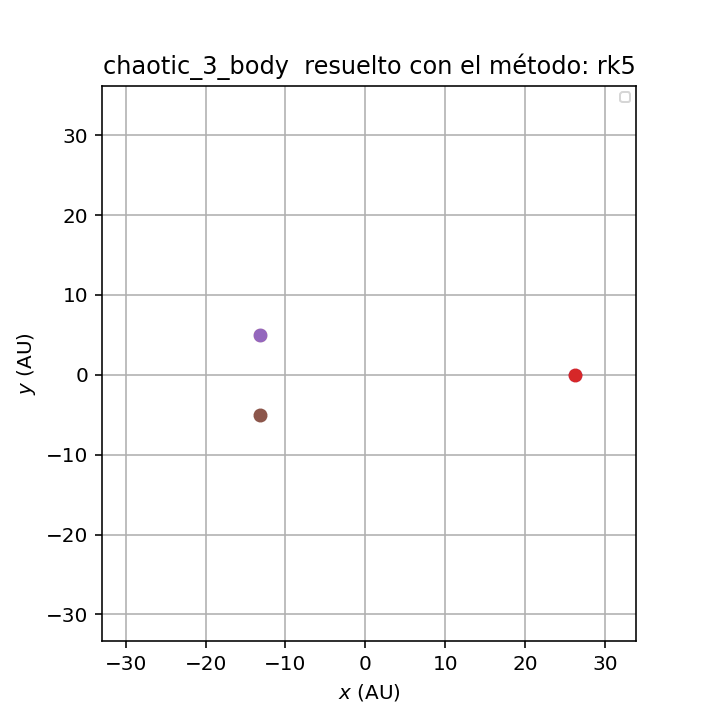
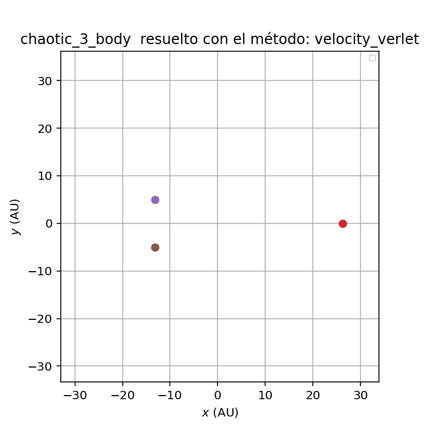
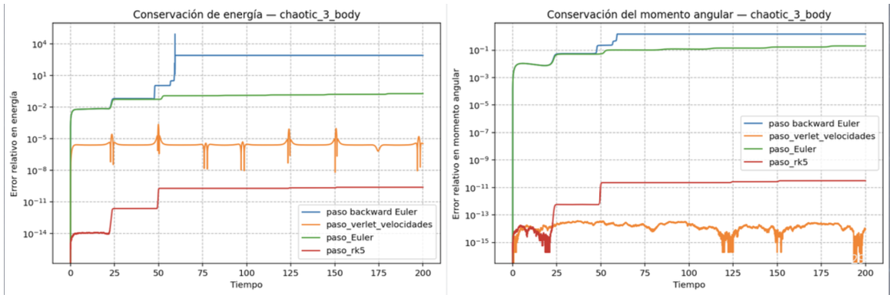
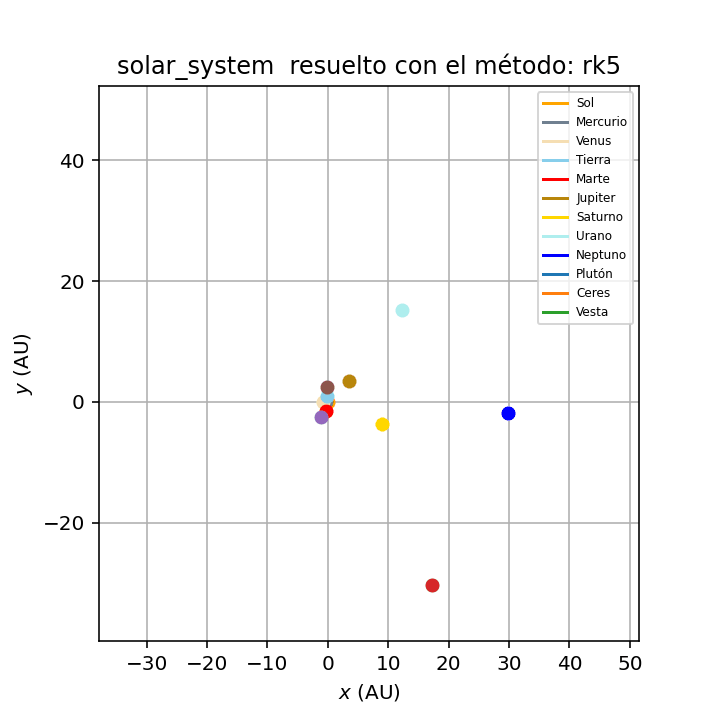

# Results and Discussion

## 1. What is being compared?

The project compares four integration methods applied to the three-body problem and to larger gravitational systems:

1. Explicit Euler.
2. Backward Euler approximated by fixed-point iteration.
3. Velocity Verlet.
4. Fifth-order Runge-Kutta-Fehlberg, implemented as `paso_rk5`.

The comparison is based on four criteria:

- Shape and qualitative stability of the trajectories.
- Conservation of total mechanical energy.
- Conservation of total angular momentum.
- Global error and simulation time.

This is important because a trajectory can look visually plausible while still violating the physical invariants of the system.

## 2. Energy and angular-momentum conservation

The total energy and total angular momentum are the central diagnostics. If a simulation violates these quantities in a large and systematic way, it is not faithfully reproducing the intended physical dynamics.

In the chaotic benchmark, **RKF5** gives the best conservation of both quantities. This agrees with its high order: it uses several intermediate acceleration evaluations and cancels low-order truncation errors. The advantage becomes especially visible when the simulation is run over longer time intervals.

**Velocity Verlet** also performs very well. Although it is only second order, its structure is much more appropriate for mechanical systems than Euler's method. Instead of producing a strong monotonic energy drift, it tends to keep the energy bounded around the correct value. This makes it a very good practical option when the goal is to preserve the character of the orbit without paying the full cost of RKF5.

**Explicit Euler** is the weakest method for long simulations. Because it uses only the current slope, it accumulates local error in a biased way. In gravitational systems this typically appears as energy drift, orbital deformation and eventual qualitative failure of the trajectory.

**Backward Euler** does not provide a clear advantage in this project. Even though the method is implicit in principle, the implemented fixed-point approximation remains first order. For rapidly varying gravitational forces, especially during close encounters, this can generate abrupt corrections and visible error spikes.

## 3. Error as a function of time step

The theoretical expectation is that the global error scales approximately as

$$
\text{error}\sim C\Delta t^p,
$$

where $p$ is the global order of the method. Therefore:

- Euler and Backward Euler have $p=1$.
- Velocity Verlet has $p=2$.
- RKF5 has $p=5$.

This explains why RKF5 improves rapidly when $\Delta t$ is reduced. Velocity Verlet remains highly competitive because it reduces the error dramatically compared with Euler while keeping the computational cost moderate.

## 4. Simulation time and cost

Euler is the cheapest method per step because it requires only one acceleration evaluation. Verlet requires roughly two. RKF5 requires several intermediate evaluations, and Backward Euler depends on the number of fixed-point iterations used.

However, cost per step is not the whole story. A low-order method may require an extremely small time step to reach the same accuracy as a higher-order method. From a precision-per-cost perspective, Velocity Verlet and RKF5 are much more useful than Euler for this project.

## 5. Periodic orbit results

### 5.1 Lagrange-type configurations

Lagrange-type orbits are regular and symmetric. They are useful as a baseline test because the numerical method should preserve a clean and stable trajectory over many steps. When a method distorts such an orbit quickly, the problem is numerical rather than physical.

### 5.2 Broucke orbit

The Broucke family is less trivial than the most symmetric cases. It is therefore a better test of whether the integrator can preserve nontrivial periodic geometry.

RKF5 and Velocity Verlet reproduce the geometry well. Euler is useful for comparison because its drift makes the long-term degradation of the orbit easier to see.

### 5.3 Skinny Pineapple and Li-Liao orbits

These orbits are more complex and more sensitive to time-step choice. They are therefore good stress tests for numerical stability.

A high-order method such as RKF5 makes the intended periodic structure clearer. Velocity Verlet remains a strong compromise, especially when many simulations must be run and cost matters.

## 6. Chaotic three-body benchmark

The chaotic case separates the methods most clearly. In a chaotic system, two close trajectories may separate for genuine physical reasons, but a poor integrator adds artificial separation caused by numerical error. This means that conservation diagnostics become essential.

| Euler | RKF5 | Velocity Verlet |
|---|---|---|
|  |  |  |

Euler produces the least reliable evolution. RKF5 and Velocity Verlet make the dynamics more interpretable because they preserve the conserved quantities much better.

## 7. Poincaré sections

The Poincaré section provides a phase-space view of the dynamics. For regular motion, the crossings form thin, repeated branches. When the initial conditions are perturbed, those branches change but can still retain structure. In chaotic motion, the crossings become more dispersed and no longer form a simple repeated curve.

This complements the GIFs. The animations show motion in physical space, while the Poincaré section shows whether the motion has regular or chaotic structure in phase space.

## 8. Earth-Moon-Sun and simplified Solar System cases

The Earth-Moon-Sun case connects the project to the historical origin of the three-body problem. The same gravitational law is used, but the masses, positions and velocities correspond to astronomical scales.

The simplified Solar System case shows the difficulty of multi-scale gravitational dynamics. Inner planets evolve much faster than outer planets, so a time step that is acceptable for one region of the system may be too large for another. This makes energy conservation and time-step choice especially important.

## 9. Three-dimensional perturbations, ejection and binary formation

When an out-of-plane perturbation is added, the dynamics become richer. In few-body gravitational interactions, it is common for two bodies to form a bound binary while a third body is ejected. This is not a violation of energy conservation. Instead, energy is redistributed: the binary becomes more tightly bound, while the escaping body gains enough energy to leave the system.

This behaviour illustrates why the three-body problem is physically important. Even a small number of bodies can generate qualitatively different final states.

## 10. Method ranking

| Rank | Method | Reason |
|---:|---|---|
| 1 | RKF5 | Best accuracy and lowest global error in the tested cases. |
| 2 | Velocity Verlet | Best balance between cost and physical conservation. |
| 3 | Explicit Euler | Useful for teaching, but not reliable for long-term dynamics. |
| 4 | Backward Euler | Does not improve the result in this implementation and may produce error spikes. |

## 11. Limitations

The current project is intentionally close to the original practice script. This makes the work easy to inspect, but it also means that the code is not yet organized as a full reusable Python package. The main limitations are:

- The code is concentrated in one large script.
- Different experiments are activated by editing/commenting blocks.
- There are no automated tests yet.
- The RKF5 implementation is used with a fixed workflow rather than as a fully adaptive solver.
- Direct pairwise acceleration calculation scales as $O(N^2)$.

These limitations do not invalidate the physics of the project. They indicate clear directions for future improvement.

## 12. Conclusion

The project demonstrates that a good gravitational simulation requires more than plotting attractive orbits. The numerical method must be judged by whether it preserves the physical structure of the system. RKF5 gives the highest accuracy, while Velocity Verlet gives the best balance between cost and conservation. Euler is valuable mainly as a pedagogical contrast, and the implemented Backward Euler scheme is not competitive for this conservative orbital problem.

## 13. Attribution note

The simulation workflow and presentation style were inspired in part by Ching-Yin Ng's `grav_sim` project and the tutorial **“5 steps to N-body simulation”**:

- <https://alvinng4.github.io/grav_sim/5_steps_to_n_body_simulation/>
- <https://github.com/alvinng4/grav_sim>

This attribution is included for academic transparency. The results discussed in this document correspond to the project code and the selected outputs included in this repository.
